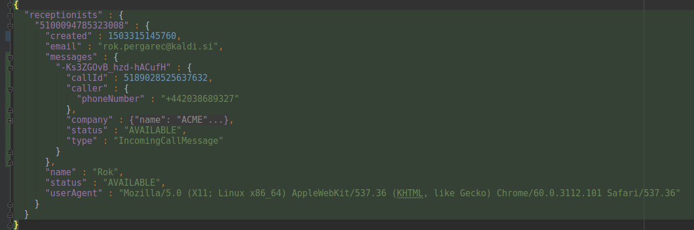

Firebase was created after developers of a service for integrating chat functionality into websites noticed that their
service was being used for other purposes such as maintaining game state across users.

---
In 2014, Firebase was acquired by Google.
---
Since Google will shutdown Channel API, which is used by Receivr for push notifications, we needed another solution.
The most obvious one is of course from... you guessed it, Google.
---
It's called *Firebase Realtime Database*. It supports the following features:
- Data synchronization: Every time data changes, any connected device receives that update
- JS and JAVA SDKs that create a persistent websocket connection to Firebase.
- Focuses on latency.
---
You can think of a Firebase database as a single JSON object, like a Redux state.
Connected clients read and write from/to the database, but the most important aspect here is data updates. Clients
subscribe to updates by registering event handlers.
---
**A snapshot of the database with one available receptionist and a new incoming call**

---
### Basic application flow

**Frontend (Receptionist's web client)**

- Client logs in to Firebase and pushes an object of it's own details to **receptionists/\<id\>** JSON node.
- Client registers an event handler for changes on **receptionists/\<id\>/messages**
- Client registers an event handler for **disconnect** event. The handler for this event removes 
**receptionists/\<id\>** JSON node so that our backend is aware that the client has disconnected.
---

### Basic application flow

**Backend (App Engine Java application)**

- Writes messages to **messages** JSON node of all **receptionists** JSON node.

